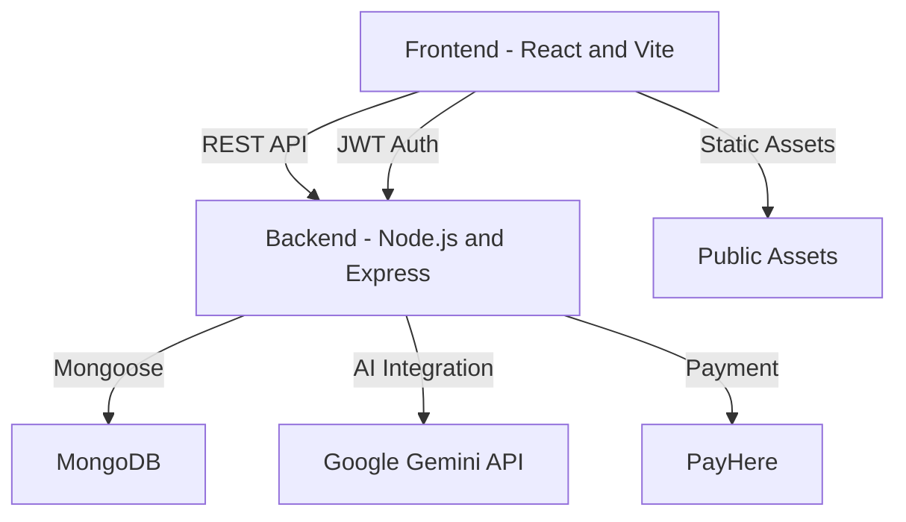

# SMTIAP Web — AI-Powered Survey & Analytics Platform

A modern, full-stack SaaS platform for creating, distributing, and analyzing surveys with advanced AI features, real-time analytics, and robust organizational management. Designed for teams, admins, and organizations to streamline feedback collection, automate insights, and manage users, roles, and billing with ease.


---

## 📑 Table of Contents

- [SMTIAP Web — AI-Powered Survey \& Analytics Platform](#smtiap-web--ai-powered-survey--analytics-platform)
  - [📑 Table of Contents](#-table-of-contents)
  - [🚀 Features](#-features)
  - [🏗️ Architecture Overview](#️-architecture-overview)
  - [⚡ Quick Start](#-quick-start)
  - [🛠️ Installation](#️-installation)
    - [Prerequisites](#prerequisites)
    - [Steps](#steps)
  - [🔑 Environment Variables](#-environment-variables)
    - [Frontend `.env.example`](#frontend-envexample)
    - [Backend `backend/.env.example`](#backend-backendenvexample)
  - [📁 Folder Structure](#-folder-structure)
  - [📡 API Overview](#-api-overview)
    - [Main Endpoints](#main-endpoints)
  - [🧑‍💻 Usage](#-usage)
  - [📜 Scripts](#-scripts)
  - [🧬 Development Workflow](#-development-workflow)
  - [🚀 Deployment](#-deployment)
  - [🤝 Contribution Guidelines](#-contribution-guidelines)
  - [🛟 Troubleshooting](#-troubleshooting)
  - [❓ FAQ](#-faq)

---

## 🚀 Features

- **AI-Powered Survey Creation & Modification**  
  Generate and edit surveys using advanced AI (Google Gemini), with support for branching logic and manual editing.
- **Drag-and-Drop Survey Builder**  
  Intuitive UI for creating, reordering, and customizing questions.
- **Branding & Logo Upload**  
  Add organization branding and logo to surveys with live preview.
- **Real-Time Analytics Dashboard**  
  Visualize responses, trends, and insights with interactive charts.
- **Role-Based Access Control**  
  Manage users, roles (admin, creator, billing, viewer), and permissions.
- **Subscription & Billing Management**  
  Integrated billing, subscription plans, and license tracking.
- **Robust Error Handling**  
  Handles AI input validation, quota/rate-limit errors, and API key issues.
- **Modern Responsive UI**  
  Built with React, Tailwind CSS, and Lucide icons for a seamless experience.
- **Secure Authentication**  
  JWT-based authentication for all users and API endpoints.

---

## 🏗️ Architecture Overview



- **Frontend:** React (Vite), Tailwind CSS, Lucide icons
- **Backend:** Node.js, Express, Mongoose, Google Gemini AI, PayHere
- **Database:** MongoDB
- **Authentication:** JWT (HttpOnly cookies)
- **Deployment:** Vercel/Netlify (Frontend), Render/Heroku (Backend) *(customize as needed)*

---


## ⚡ Quick Start

```bash
# 1. Clone the repository
git clone https://github.com/<your-org>/<your-repo>.git
cd smtiap-web

# 2. Install dependencies for frontend & backend
npm install
cd backend
npm install
cd ..

# 3. Setup environment variables
cp .env.example .env
cp backend/.env.example backend/.env

# 4. Start MongoDB (locally or with Docker)
# Example (Docker):
docker run -d -p 27017:27017 --name mongo mongo

# 5. Seed the database (optional)
cd backend
npm run seed
cd ..

# 6. Start the backend server
cd backend
npm run dev
cd ..

# 7. Start the frontend (Vite)
npm run dev
```

---

## 🛠️ Installation

### Prerequisites

- Node.js v18+
- npm v9+
- MongoDB (local or cloud)
- [Optional] Docker

### Steps

1. **Clone the repository**
   ```bash
   git clone https://github.com/<your-org>/<your-repo>.git
   cd smtiap-web
   ```

2. **Install dependencies**
   ```bash
   npm install
   cd backend
   npm install
   cd ..
   ```

3. **Setup environment variables**  
   See [Environment Variables](#environment-variables).

4. **Start MongoDB**  
   - Local: `mongod`
   - Docker: `docker run -d -p 27017:27017 --name mongo mongo`

5. **Seed the database (optional)**
   ```bash
   cd backend
   npm run seed
   cd ..
   ```

6. **Run the backend**
   ```bash
   cd backend
   npm run dev
   cd ..
   ```

7. **Run the frontend**
   ```bash
   npm run dev
   ```

---

## 🔑 Environment Variables

### Frontend `.env.example`

```env
VITE_API_URL=http://localhost:5000
VITE_GOOGLE_CLIENT_ID=your-google-client-id
VITE_PAYHERE_MERCHANT_ID=your-payhere-merchant-id
```

### Backend `backend/.env.example`

```env
PORT=5000
MONGO_URI=mongodb://localhost:27017/smtiap
JWT_SECRET=your_jwt_secret
PAYHERE_MERCHANT_ID=your_payhere_merchant_id
PAYHERE_SECRET=your_payhere_secret
SUPER_ADMIN_EMAIL=superadmin@smtiap.com
SUPER_ADMIN_PASSWORD=SuperAdmin@12345
SUPER_ADMIN_USERNAME=Super Admin
CREATE_DEFAULT_SUPER_ADMIN=true
```

> _Copy these files and fill in your actual credentials before running the project._

You can bootstrap the super admin account with:

```bash
cd backend
npm run seed
```

---

## 📁 Folder Structure

```
smtiap-web/
├── backend/
│   ├── config/
│   ├── controllers/
│   ├── middleware/
│   ├── models/
│   ├── routes/
│   ├── utils/
│   ├── server.ts
│   ├── seed.ts
│   └── ...
├── public/
├── src/
│   ├── api/
│   ├── assets/
│   ├── components/
│   ├── hooks/
│   ├── pages/
│   ├── types/
│   ├── utils/
│   ├── App.tsx
│   └── ...
├── package.json
├── vite.config.ts
├── tsconfig.json
└── README.md
```

---

## 📡 API Overview

### Main Endpoints

| Method | Endpoint                       | Description                        |
|--------|-------------------------------|------------------------------------|
| POST   | `/api/ai/generate-survey`     | Generate survey with AI            |
| POST   | `/api/ai/modify-survey`       | Modify survey with AI              |
| GET    | `/api/dashboard/stats`        | Get dashboard statistics           |
| GET    | `/api/surveys`                | List all surveys                   |
| POST   | `/api/surveys`                | Create a new survey                |
| GET    | `/api/users`                  | List users                         |
| POST   | `/api/auth/login`             | User login                         |
| POST   | `/api/auth/register`          | User registration                  |
| ...    | *(see backend/routes/)*       | *(more endpoints available)*       |


---

## 🧑‍💻 Usage

- **Login/Register:** Access the platform via `/login` or `/register`.
- **Create Survey:** Use the dashboard or "New Survey" button to start.
- **AI Survey:** Use the AI prompt to auto-generate or modify surveys.
- **Manual Edit:** Drag, drop, and edit questions as needed.
- **Branding:** Upload your organization logo and set branding.
- **Publish & Share:** Review, publish, and share surveys with your team.
- **Analytics:** View real-time analytics and AI-powered insights.
- **Manage Users/Roles:** Admins can add, remove, and assign roles.
- **Billing:** Manage subscription and view invoices in the billing section.

---

## 📜 Scripts

| Script            | Description                       |
|-------------------|-----------------------------------|
| `npm run dev`     | Start frontend (Vite)             |
| `npm run build`   | Build frontend for production     |
| `npm run lint`    | Lint frontend code                |
| `npm run test`    | Run frontend tests                |
| `cd backend`      | Enter backend directory           |
| `npm run dev`     | Start backend (nodemon)           |
| `npm run seed`    | Seed backend database             |
| `npm run test`    | Run backend tests                 |

---

## 🧬 Development Workflow

1. **Fork & Clone:**  
   Fork the repo and clone to your machine.

2. **Branch:**  
   Create a feature branch:  
   `git checkout -b feat/your-feature`

3. **Code & Commit:**  
   Make changes and commit with clear messages.

4. **Push & PR:**  
   Push to your fork and open a Pull Request.

5. **Review:**  
   Wait for review and address feedback.

6. **Merge:**  
   Once approved, merge to `main`.

---

## 🚀 Deployment

- **Frontend:**  
  Deploy `smtiap-web` (root) with Vercel, Netlify, or your preferred static host.

- **Backend:**  
  Deploy `backend/` with Render, Heroku, Railway, or your preferred Node.js host.

- **MongoDB:**  
  Use MongoDB Atlas or a managed MongoDB service.

- **Environment Variables:**  
  Set all required variables in your deployment platform.

---


## 🤝 Contribution Guidelines

- Open issues for bugs/feature requests.
- Fork and create feature branches.
- Write clear, descriptive commit messages.
- Ensure code passes lint and tests.
- Add/Update documentation as needed.
- Submit Pull Requests for review.

---

## 🛟 Troubleshooting

- **Port in use:**  
  Change the `PORT` in `.env` or stop other processes.

- **MongoDB not running:**  
  Ensure MongoDB is running locally or update `MONGO_URI`.

- **AI API errors:**  
  Check your `GOOGLE_AI_API_KEY` and quota.

- **CORS issues:**  
  Update backend CORS settings if needed.

- **Frontend/Backend not connecting:**  
  Verify `VITE_API_URL` and backend server status.

---

## ❓ FAQ

**Q: Can I use my own AI API key?**  
A: Yes, set `GOOGLE_AI_API_KEY` in `backend/.env`.

**Q: How do I add more roles?**  
A: Update the roles in `backend/models/` and `src/pages/RoleManagement.tsx`.

**Q: Can I deploy on my own server?**  
A: Yes, see [Deployment](#deployment).

**Q: How do I reset my password?**  
A: Use the "Forgot Password" link on the login page.


---

> _Made with ❤️ by the Team-21_

---
